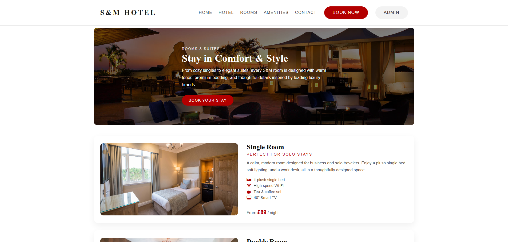
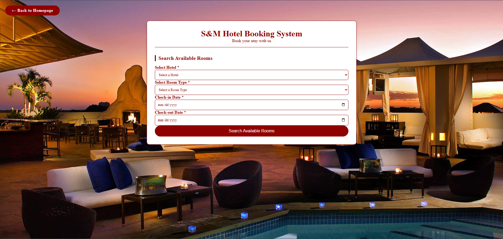
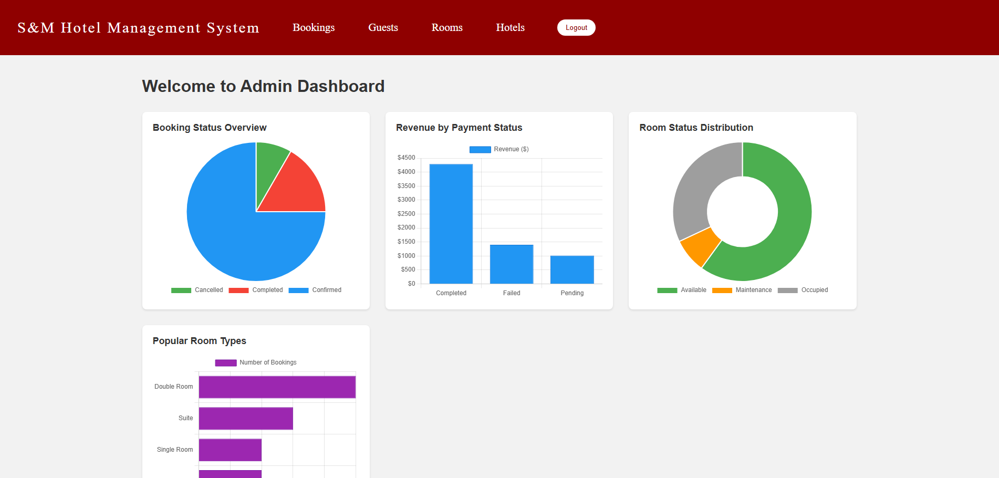
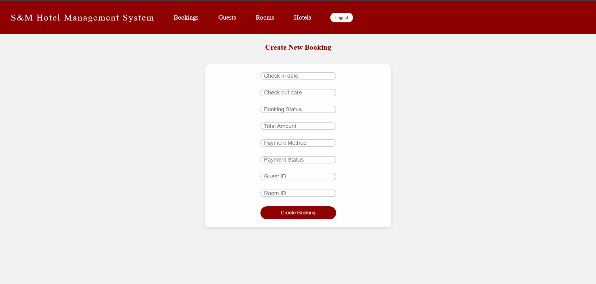
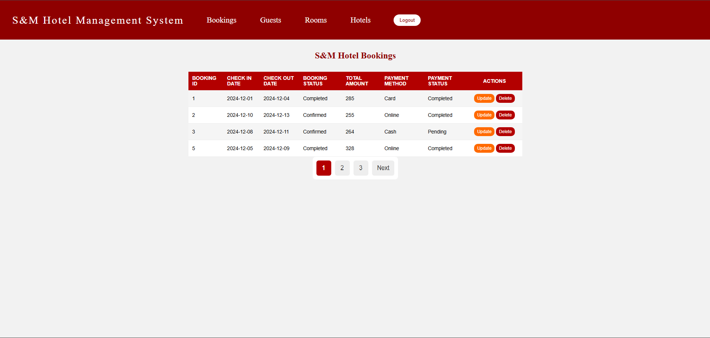

<p align="center">

# 🏨 S&M Hotel Booking System

</p>

<p align="center">
A complete hotel booking management system built with <b>PHP</b> and <b>SQLite</b>.
</p>

<p align="center">


</p>

---

# 📖 Overview

The **S&M Hotel Booking System** is a web-based application that allows guests to search and book hotel rooms while providing administrators with a dashboard to manage hotels, rooms, guests, and bookings.

---

# ✨ Features

## Public Side

- Responsive homepage displaying hotels and rooms
- Room search by date and room type
- Booking form for guests
- Instant booking feedback

## Admin Side

- Secure login
- Dashboard with charts using Chart.js
- Manage bookings, guests, rooms, and hotels
- Pagination for listings
- Simple navigation

---

# 🧰 Technologies Used

### Backend
- PHP (procedural)
- SQLite3

### Frontend
- HTML5
- CSS3
- JavaScript

### Libraries
- Chart.js
- Font Awesome

---

# 🚀 Installation

## Prerequisites

- PHP 7.4+
- SQLite extension enabled
- Web server (Apache / Nginx / XAMPP)

---

# 📥 Steps

## 1 Clone Repository

```bash
git clone https://github.com/YOUR_USERNAME/sm-hotel-booking.git
cd sm-hotel-booking
```

## 2 Start PHP Server

```bash
php -S localhost:8000
```

## 3 Open in Browser

Public site

```
http://localhost:8000/index.php
```

Admin panel

```
http://localhost:8000/admin/adminLogin.php
```

---

# 🔑 Default Admin Credentials

| Username | Password |
|--------|--------|
| james.manager | admin2024! |

⚠️ Security Note:  
Passwords are stored in plain text for demonstration purposes.

In production always use:

```
password_hash()
password_verify()
```

---

# 📁 Project Structure

```
sm-hotel-booking/

index.php
booking.php
booking_functions.php
functions.php
db_connect.php
navbar.html
script.js
viewRoom.html

style/
   style.css
   booking.css

admin/
   adminLogin.php
   admin_dashboard.php
   admin_navbar.php
   admin_functions.php
   admin.css
   get_chart_data.php

   create_booking.php
   update_booking.php
   delete_booking.php
   viewBookings.php

   create_guest.php
   update_guest.php
   delete_guest.php
   viewGuest.php

   create_room.php
   update_room.php
   delete_room.php
   viewRooms.php

   create_hotel.php
   update_hotel.php
   delete_hotel.php
   viewHotel.php

SM_Hotel.db
```

---

# 📸 Screenshots

### Homepage


### Rooms



### Booking Page



### Admin Dashboard



### Add Booking



### View Booking



---

# 🔮 Future Improvements

- Implement password hashing
- Add email confirmation after booking
- Integrate payment gateway (Stripe / PayPal)
- Improve UI using Bootstrap or Tailwind
- Add multilingual support
- Generate printable invoices

---

# 📄 License

MIT License

---

# 👨‍💻 Authors

Developed by **Aqlan and Team**

University Web Development Project
